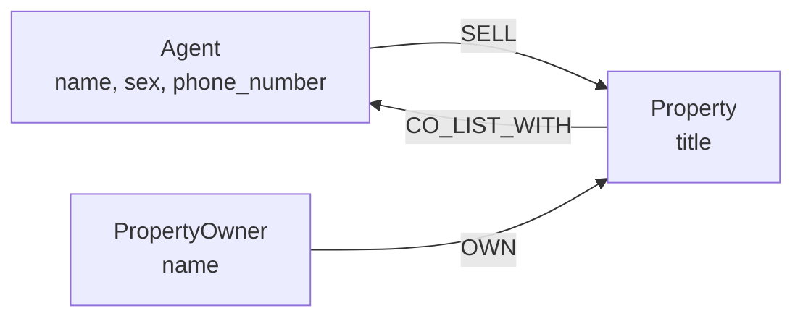

#  Property Agent Collaboration & Recommendation System

Looking for a suitable agent to sell/list a property based on collaborative relationships (CO_LIST_WITH) and the properties they have previously handled.

# Why A graph database?

Because real estate data is highly relationship-oriented. A property can be owned by a property owner, sold by an agent, and co-listed with other agents. These relationships can also form a network between agents across multiple properties.


## 1. Nodes & Labels

| Label | Description |
|---|---|
| `Agent` | Property Agent who sells and co-lists with a property |
| `Property` | Property for sale  |
| `PropertyOwner` | Owner of Property |

## 2. Node Properties

| Node | Properties |
|---|---|
| `Agent` | `name`, `sex`, `phone_number` |
| `Property` | `title` |
| `PropertyOwner` | `name` |

## 3. Relationships

| Relationship | Direction | Description |
|---|---|---|
| `SELL` | `(Agent)-[:SALES]->(Property)` | Agent Sells a property |
| `CO_LIST_WITH` | `(Property)-[:CO_LIST_WITH]->(Agent)` | The property is co-listed with another agent |
| `OWN` | `(PropertyOwner)-[:OWN]->(Property)` | PropertyOwner owns a Property |

## 4. Diagram



## 5. Setup 

### Getting Started with CognoDB

1. **Create an account**  
   Go to [console.cognodb.com/signup](https://console.cognodb.com/signup) and sign up.  
   > **Note:** The free tier requires no credit card.

2. **Create a free instance**  
   From the console, create a free (`c0`) instance and select your desired region.  
   - Provisions in under a minute.  
   - Each workspace includes one free instance.

3. **Save your connection details**  
   You will receive a connection URI in the following format:  
   `bolt+s://<instance-id>.databases.cognodb.cloud`  

   Along with a generated password for the username **`cognodb`**.  
   > ⚠️ **Important:** The password is shown **only once**. Copy or download it immediately and store it securely where your application reads secrets.

4. **Connect using an official Neo4j driver**  
   - Install the official Neo4j driver for your preferred programming language.  
   - Point the driver to your `bolt+s://` URI using the username **`cognodb`** and your saved password.  
   - Run your first Cypher query.  

   *No other code changes are required!*

## 6. Run Instrunction

### 🚀 Database Seeding & Execution

#### 1. Menjalankan Seeder via Terminal
Untuk mengisi database secara otomatis menggunakan skrip NPM, jalankan perintah berikut di terminal:

```bash
npm run seed
```
##### 🖥️ Eksekusi Manual via CognoDB Console / Browser

Jika Anda ingin menjalankan Cypher query secara manual langsung di console CognoDB/Browser, silakan gunakan file-file pada folder `cypher/`:

* 📄 **`cypher/seed.cypher`**  
  Menguraikan perintah untuk pembuatan *nodes*, *labels*, dan *relationships* awal.
* 📄 **`cypher/queries.cypher`**  
  Menyediakan query utama untuk menguji pencarian rekomendasi agen dan properti.

> **Tips:** Pastikan Anda mengeksekusi `seed.cypher` terlebih dahulu agar struktur graph terbentuk sebelum menjalankan query di `queries.cypher`.

## 7. Main Queries Explained

```cypher
// Find primary agents which an agent has previously collaborated with
MATCH (coAgent:Agent {name: $name})
      <-[:CO_LIST_WITH]-
      (p:Property)
      <-[:SELL]-
      (mainAgent:Agent)
WHERE mainAgent <> coAgent
RETURN DISTINCT mainAgent.name AS collaborator

//Find recommended agents and their network based on a search for owner names whose properties have been sold.

MATCH (owner:PropertyOwner {name: $name})
      -[:OWN]->(property:Property)
      <-[:SELL]-
      (agent:Agent)

MATCH path =
      (agent)
      <-[:CO_LIST_WITH]-
      (:Property)
      <-[:SELL]-
      (networkAgent:Agent)

RETURN DISTINCT
    agent.name AS sellingAgent,
    networkAgent.name AS recommendedAgent,
    length(path) AS hops
ORDER BY hops

```


## 8. Screenshot of the UI
 