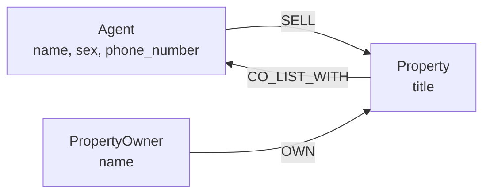

#  Property Agent Collaboration & Recommendation System

## 1. Nodes & Labels

| Label | Description |
|---|---|
| `Agent` | Property Agent who sells and co-lists with a property |
| `Property` | Property for sale  |
| `PropertyOwner` | Owner of Property |

## 2. Node Properties

| Node | Properties |
|---|---|
| `Agent` | `name`, `sex`, `phone_number` |
| `Property` | `title` |
| `PropertyOwner` | `name` |

## 3. Relationships

| Relationship | Direction | Description |
|---|---|---|
| `SELL` | `(Agent)-[:SALES]->(Property)` | Agent Sells a property |
| `CO_LIST_WITH` | `(Property)-[:CO_LIST_WITH]->(Agent)` | The property is co-listed with another agent |
| `OWN` | `(PropertyOwner)-[:OWN]->(Property)` | PropertyOwner owns a Property |

## 4. Diagram

 